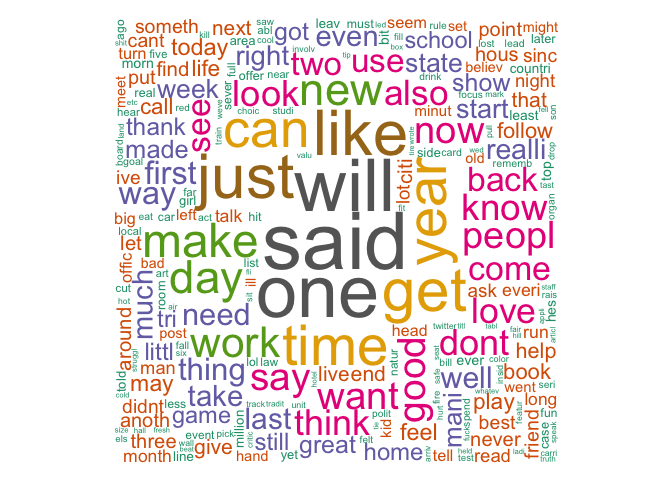

# Capstone Project - Milestone Report
Maximilian H. Nierhoff  

# Introduction

This milestone report will be applying data science in the area of natural language processing. The following lines addressing the data extraction, cleaning and text mining of the so called [HC Copora](http://www.corpora.heliohost.org). This report is part of the data science capstone project of [Coursera](https://www.coursera.org) and [Swiftkey](http://swiftkey.com/). The plots, code chunks and remarks will explain the reader the main steps to reach this goal. 


# Data Processing

The data set consists of three files in US English.

### Loading The Dataset 

```r
fileURL <- "http://d396qusza40orc.cloudfront.net/dsscapstone/dataset/Coursera-SwiftKey.zip"
download.file(fileURL, destfile = "Dataset.zip", method = "curl")
unlink(fileURL)
unzip("Dataset.zip")
```


### Aggreagating A Data Sample

In order to enable faster data processing, a data sample from all three sources was generated.


```r
sampleTwitter <- twitter[sample(1:length(twitter),10000)]
sampleNews <- news[sample(1:length(news),10000)]
sampleBlogs <- blogs[sample(1:length(blogs),10000)]
textSample <- c(sampleTwitter,sampleNews,sampleBlogs)
```


# Summary Statistics


File Name            File Size in Megabyte   Line Count   Word Count
------------------  ----------------------  -----------  -----------
Blogs                               200.42       899288     37334147
News                                196.28      1010242     34372530
Twitter                             159.36      2360148     30373603
Aggregated Sample                     2.42        15000        15000


```r
trigramTDM <- TermDocumentMatrix(finalCorpus)
wcloud <- as.matrix(trigramTDM)
v <- sort(rowSums(wcloud),decreasing=TRUE)
d <- data.frame(word = names(v),freq=v)
wordcloud(d$word,d$freq,
          c(5,.3),50,
          random.order=FALSE,
          colors=brewer.pal(8, "Dark2"))
```

 


# Building A Clean Cleaning


```r
## Make it work with the new tm package
cleanSample <- tm_map(cleanSample, content_transformer(function(x) iconv(x, to="UTF-8", sub="byte")), 
                      mc.cores=2)
## Convert to lower case, remove punction, numbers, URLs, stop, profanity and stem wordson
cleanSample <- tm_map(cleanSample, content_transformer(tolower), lazy = TRUE)
cleanSample <- tm_map(cleanSample, content_transformer(removePunctuation))
cleanSample <- tm_map(cleanSample, content_transformer(removeNumbers))
removeURL <- function(x) gsub("http[[:alnum:]]*", "", x) 
cleanSample <- tm_map(cleanSample, content_transformer(removeURL))
cleanSample <- tm_map(cleanSample, stripWhitespace)
cleanSample <- tm_map(cleanSample, removeWords, stopwords("english"))
cleanSample <- tm_map(cleanSample, removeWords, profanityWords)
cleanSample <- tm_map(cleanSample, stemDocument)
cleanSample <- tm_map(cleanSample, stripWhitespace)
```


## The N-Gram Tokenization

```r
ngramTokenizer <- function(theCorpus, ngramCount) {
        ngramFunction <- NGramTokenizer(theCorpus, 
                                Weka_control(min = ngramCount, max = ngramCount, 
                                delimiters = " \\r\\n\\t.,;:\"()?!"))
        ngramFunction <- data.frame(table(ngramFunction))
        ngramFunction <- ngramFunction[order(ngramFunction$Freq, 
                                             decreasing = TRUE),][1:10,]
        colnames(ngramFunction) <- c("String","Count")
        ngramFunction
}
```


### Top Unigrams

```r
unigram <- readRDS("./unigram.RDS")
unigramPlot <- gvisColumnChart(unigram, "String", "Count",                  
                            options=list(legend="none"))

print(unigramPlot, "chart")
```

<!-- ColumnChart generated in R 3.1.3 by googleVis 0.5.8 package -->
<!-- Sun Mar 29 22:29:10 2015 -->


<!-- jsHeader -->
<script type="text/javascript">
 
// jsData 
function gvisDataColumnChartID25cb50ebedff () {
var data = new google.visualization.DataTable();
var datajson =
[
 [
 "said",
1531 
],
[
 "one",
1409 
],
[
 "will",
1390 
],
[
 "like",
1192 
],
[
 "just",
1168 
],
[
 "get",
1129 
],
[
 "time",
1054 
],
[
 "year",
1045 
],
[
 "go",
1005 
],
[
 "can",
990 
] 
];
data.addColumn('string','String');
data.addColumn('number','Count');
data.addRows(datajson);
return(data);
}
 
// jsDrawChart
function drawChartColumnChartID25cb50ebedff() {
var data = gvisDataColumnChartID25cb50ebedff();
var options = {};
options["allowHtml"] = true;
options["legend"] = "none";

    var chart = new google.visualization.ColumnChart(
    document.getElementById('ColumnChartID25cb50ebedff')
    );
    chart.draw(data,options);
    

}
  
 
// jsDisplayChart
(function() {
var pkgs = window.__gvisPackages = window.__gvisPackages || [];
var callbacks = window.__gvisCallbacks = window.__gvisCallbacks || [];
var chartid = "corechart";
  
// Manually see if chartid is in pkgs (not all browsers support Array.indexOf)
var i, newPackage = true;
for (i = 0; newPackage && i < pkgs.length; i++) {
if (pkgs[i] === chartid)
newPackage = false;
}
if (newPackage)
  pkgs.push(chartid);
  
// Add the drawChart function to the global list of callbacks
callbacks.push(drawChartColumnChartID25cb50ebedff);
})();
function displayChartColumnChartID25cb50ebedff() {
  var pkgs = window.__gvisPackages = window.__gvisPackages || [];
  var callbacks = window.__gvisCallbacks = window.__gvisCallbacks || [];
  window.clearTimeout(window.__gvisLoad);
  // The timeout is set to 100 because otherwise the container div we are
  // targeting might not be part of the document yet
  window.__gvisLoad = setTimeout(function() {
  var pkgCount = pkgs.length;
  google.load("visualization", "1", { packages:pkgs, callback: function() {
  if (pkgCount != pkgs.length) {
  // Race condition where another setTimeout call snuck in after us; if
  // that call added a package, we must not shift its callback
  return;
}
while (callbacks.length > 0)
callbacks.shift()();
} });
}, 100);
}
 
// jsFooter
</script>
 
<!-- jsChart -->  
<script type="text/javascript" src="https://www.google.com/jsapi?callback=displayChartColumnChartID25cb50ebedff"></script>
 
<!-- divChart -->
  
<div id="ColumnChartID25cb50ebedff" 
  style="width: 500; height: automatic;">
</div>

### Top Bigrams

```r
bigram <- readRDS("./bigram.RDS")
bigramPlot <- gvisColumnChart(bigram, "String", "Count",                  
                            options=list(legend="none"))

print(bigramPlot, "chart")
```

<!-- ColumnChart generated in R 3.1.3 by googleVis 0.5.8 package -->
<!-- Sun Mar 29 22:29:10 2015 -->


<!-- jsHeader -->
<script type="text/javascript">
 
// jsData 
function gvisDataColumnChartID25cbfd5c084 () {
var data = new google.visualization.DataTable();
var datajson =
[
 [
 "last year",
97 
],
[
 "new york",
90 
],
[
 "right now",
81 
],
[
 "look like",
80 
],
[
 "year ago",
80 
],
[
 "dont know",
69 
],
[
 "last week",
67 
],
[
 "high school",
59 
],
[
 "feel like",
57 
],
[
 "first time",
55 
] 
];
data.addColumn('string','String');
data.addColumn('number','Count');
data.addRows(datajson);
return(data);
}
 
// jsDrawChart
function drawChartColumnChartID25cbfd5c084() {
var data = gvisDataColumnChartID25cbfd5c084();
var options = {};
options["allowHtml"] = true;
options["legend"] = "none";

    var chart = new google.visualization.ColumnChart(
    document.getElementById('ColumnChartID25cbfd5c084')
    );
    chart.draw(data,options);
    

}
  
 
// jsDisplayChart
(function() {
var pkgs = window.__gvisPackages = window.__gvisPackages || [];
var callbacks = window.__gvisCallbacks = window.__gvisCallbacks || [];
var chartid = "corechart";
  
// Manually see if chartid is in pkgs (not all browsers support Array.indexOf)
var i, newPackage = true;
for (i = 0; newPackage && i < pkgs.length; i++) {
if (pkgs[i] === chartid)
newPackage = false;
}
if (newPackage)
  pkgs.push(chartid);
  
// Add the drawChart function to the global list of callbacks
callbacks.push(drawChartColumnChartID25cbfd5c084);
})();
function displayChartColumnChartID25cbfd5c084() {
  var pkgs = window.__gvisPackages = window.__gvisPackages || [];
  var callbacks = window.__gvisCallbacks = window.__gvisCallbacks || [];
  window.clearTimeout(window.__gvisLoad);
  // The timeout is set to 100 because otherwise the container div we are
  // targeting might not be part of the document yet
  window.__gvisLoad = setTimeout(function() {
  var pkgCount = pkgs.length;
  google.load("visualization", "1", { packages:pkgs, callback: function() {
  if (pkgCount != pkgs.length) {
  // Race condition where another setTimeout call snuck in after us; if
  // that call added a package, we must not shift its callback
  return;
}
while (callbacks.length > 0)
callbacks.shift()();
} });
}, 100);
}
 
// jsFooter
</script>
 
<!-- jsChart -->  
<script type="text/javascript" src="https://www.google.com/jsapi?callback=displayChartColumnChartID25cbfd5c084"></script>
 
<!-- divChart -->
  
<div id="ColumnChartID25cbfd5c084" 
  style="width: 500; height: automatic;">
</div>

### Top Trigrams

```r
trigram <- readRDS("./trigram.RDS")
trigramPlot <- gvisColumnChart(trigram, "String", "Count",                  
                            options=list(legend="none"))

print(trigramPlot, "chart")
```

<!-- ColumnChart generated in R 3.1.3 by googleVis 0.5.8 package -->
<!-- Sun Mar 29 22:29:11 2015 -->


<!-- jsHeader -->
<script type="text/javascript">
 
// jsData 
function gvisDataColumnChartID25cb6455cfd () {
var data = new google.visualization.DataTable();
var datajson =
[
 [
 "let us know",
10 
],
[
 "presid barack obama",
10 
],
[
 "cant wait see",
8 
],
[
 "new york citi",
8 
],
[
 "happi mother day",
7 
],
[
 "osama bin laden",
7 
],
[
 "two year ago",
7 
],
[
 "dont even know",
6 
],
[
 "execut order issu",
6 
],
[
 "ive ever seen",
6 
] 
];
data.addColumn('string','String');
data.addColumn('number','Count');
data.addRows(datajson);
return(data);
}
 
// jsDrawChart
function drawChartColumnChartID25cb6455cfd() {
var data = gvisDataColumnChartID25cb6455cfd();
var options = {};
options["allowHtml"] = true;
options["legend"] = "none";

    var chart = new google.visualization.ColumnChart(
    document.getElementById('ColumnChartID25cb6455cfd')
    );
    chart.draw(data,options);
    

}
  
 
// jsDisplayChart
(function() {
var pkgs = window.__gvisPackages = window.__gvisPackages || [];
var callbacks = window.__gvisCallbacks = window.__gvisCallbacks || [];
var chartid = "corechart";
  
// Manually see if chartid is in pkgs (not all browsers support Array.indexOf)
var i, newPackage = true;
for (i = 0; newPackage && i < pkgs.length; i++) {
if (pkgs[i] === chartid)
newPackage = false;
}
if (newPackage)
  pkgs.push(chartid);
  
// Add the drawChart function to the global list of callbacks
callbacks.push(drawChartColumnChartID25cb6455cfd);
})();
function displayChartColumnChartID25cb6455cfd() {
  var pkgs = window.__gvisPackages = window.__gvisPackages || [];
  var callbacks = window.__gvisCallbacks = window.__gvisCallbacks || [];
  window.clearTimeout(window.__gvisLoad);
  // The timeout is set to 100 because otherwise the container div we are
  // targeting might not be part of the document yet
  window.__gvisLoad = setTimeout(function() {
  var pkgCount = pkgs.length;
  google.load("visualization", "1", { packages:pkgs, callback: function() {
  if (pkgCount != pkgs.length) {
  // Race condition where another setTimeout call snuck in after us; if
  // that call added a package, we must not shift its callback
  return;
}
while (callbacks.length > 0)
callbacks.shift()();
} });
}, 100);
}
 
// jsFooter
</script>
 
<!-- jsChart -->  
<script type="text/javascript" src="https://www.google.com/jsapi?callback=displayChartColumnChartID25cb6455cfd"></script>
 
<!-- divChart -->
  
<div id="ColumnChartID25cb6455cfd" 
  style="width: 500; height: automatic;">
</div>


# Session Informations

```r
sessionInfo()
```

```
## R version 3.1.3 (2015-03-09)
## Platform: x86_64-apple-darwin13.4.0 (64-bit)
## Running under: OS X 10.10.2 (Yosemite)
## 
## locale:
## [1] de_DE.UTF-8/de_DE.UTF-8/de_DE.UTF-8/C/de_DE.UTF-8/de_DE.UTF-8
## 
## attached base packages:
## [1] stats     graphics  grDevices utils     datasets  methods   base     
## 
## other attached packages:
##  [1] googleVis_0.5.8        stringi_0.4-1          DT_0.0.8              
##  [4] stringr_0.6.2          wordcloud_2.5          rJava_0.9-6           
##  [7] RWeka_0.4-24           slam_0.1-32            SnowballC_0.5.1       
## [10] tm_0.6                 NLP_0.1-6              qdap_2.2.1            
## [13] RColorBrewer_1.1-2     qdapTools_1.1.0        qdapRegex_0.2.1       
## [16] qdapDictionaries_1.0.3 RWekajars_3.7.12-1    
## 
## loaded via a namespace (and not attached):
##  [1] assertthat_0.1      bitops_1.0-6        chron_2.3-45       
##  [4] colorspace_1.2-6    data.table_1.9.4    DBI_0.3.1          
##  [7] devtools_1.7.0      digest_0.6.8        dplyr_0.4.1        
## [10] evaluate_0.5.5      formatR_1.0         gdata_2.13.3       
## [13] gender_0.4.3        ggplot2_1.0.1       grid_3.1.3         
## [16] gridExtra_0.9.1     gtable_0.1.2        gtools_3.4.1       
## [19] htmltools_0.2.8     htmlwidgets_0.3.2   httr_0.6.1.9000    
## [22] igraph_0.7.1        jsonlite_0.9.15     knitr_1.9          
## [25] magrittr_1.5        MASS_7.3-40         munsell_0.4.2      
## [28] openNLP_0.2-4       openNLPdata_1.5.3-1 parallel_3.1.3     
## [31] plotrix_3.5-11      plyr_1.8.1          proto_0.3-10       
## [34] Rcpp_0.11.5         RCurl_1.95-4.5      reports_0.1.4      
## [37] reshape2_1.4.1      RJSONIO_1.3-0       rmarkdown_0.5.1    
## [40] rstudioapi_0.2      scales_0.2.4        tools_3.1.3        
## [43] venneuler_1.1-0     xlsx_0.5.7          xlsxjars_0.6.1     
## [46] XML_3.98-1.1        yaml_2.1.13
```


