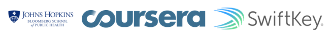
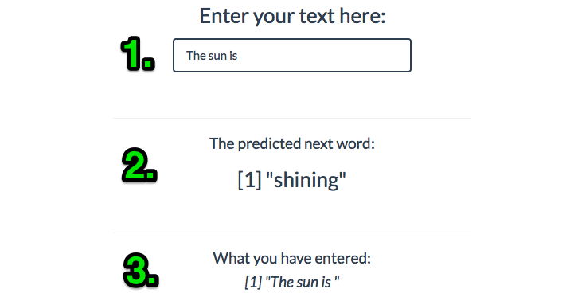

### Coursera Data Science Capstone Project

This application is the capstone project for the Coursera Data Science specialization held by professors of the Johns Hopkins University and in cooperation with SwiftKey.

******

#### The Objective

The main goal of this capstone project is to build a shiny application that is able to predict the next word. 

This exercise was divided into seven sub tasks like data cleansing, exploratory analysis, the creation of a predictive model and more.

All text data that is used to create a frequency dictionary and thus to predict the next words comes from a corpus called [HC Corpora](http://www.corpora.heliohost.org/). 

All text mining and natural language processing was done with the usage of a variety of well-known R packages.

******

#### The Applied Methods & Models

After creating a data sample from the HC Corpora data, this sample was cleaned by conversion to lowercase, removing punctuation, links, white space, numbers and all kinds of special characters.
This data sample was then [tokenized](http://en.wikipedia.org/wiki/Tokenization_%28lexical_analysis%29) into so-called [*n*-grams](http://en.wikipedia.org/wiki/N-gram). 
> In the fields of computational linguistics and probability, an *n*-gram is a contiguous sequence of n items from a given sequence of text or speech. ([Source](http://en.wikipedia.org/wiki/N-gram))

Those aggregated bi-,tri- and quadgram term frequency matrices have been transferred into frequency dictionaries.

The resulting data.frames are used to predict the next word in connection with the text input by a user of the described application and the frequencies of the underlying *n*-grams table.

******

#### The Usage Of The Application

The user interface of this application was designed with **Mobile First** in mind. While entering the text (**1**), the field with the predicted next word (**2**) refreshes instantaneously and  also the whole text input (**3**) gets displayed.

******

#### Additional Information

* The next word prediction app is hosted on shinyapps.io: [https://nierhoff.shinyapps.io/cdsc](https://nierhoff.shinyapps.io/cdsc)

* In the case of any inaccessibility the same app is also hosted on my private shiny server: [http://apps.nierhoff.info/cdsc](http://apps.nierhoff.info/cdsc)

* The whole code of this application, as well as all the milestone report, related scripts, this presentation  etc. can be found in this GitHub repo: [https://github.com/mhnierhoff/CapstoneCoursera](https://github.com/mhnierhoff/CapstoneCoursera)

* This pitch deck is located here: [http://rpubs.com/nierhoff/cdsc](http://rpubs.com/nierhoff/cdsc)

* Learn more about the Coursera Data Science Specialization: [https://www.coursera.org/specialization/jhudatascience/1](https://www.coursera.org/specialization/jhudatascience/1)
